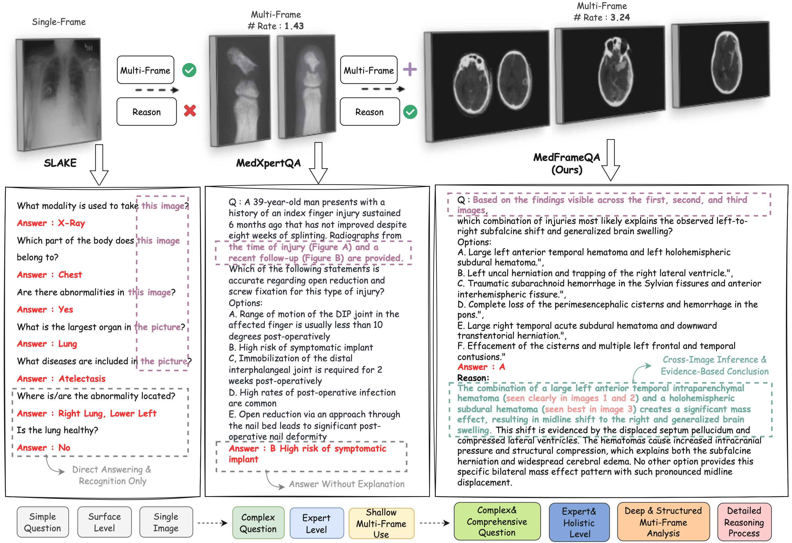
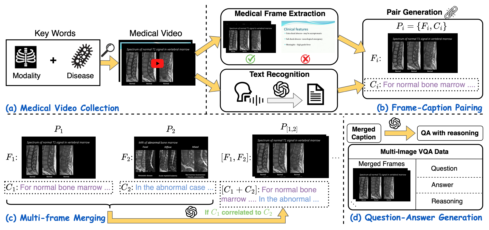
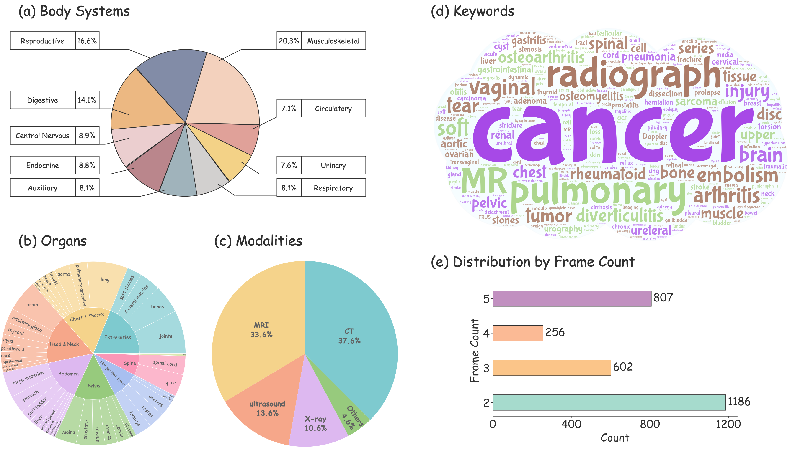
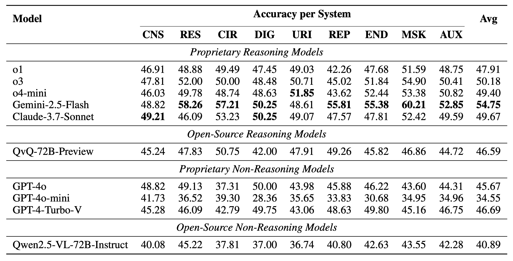
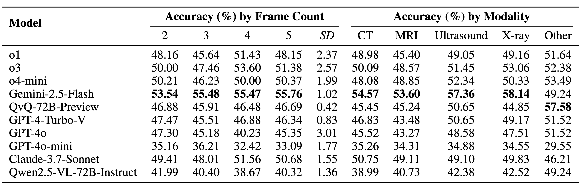

# <div align="center"> MedFrameQA: A Multi-Image Medical VQA Benchmark for Clinical Reasoning <div>


<div align="center">
  <a href="https://github.com/haojinw0027/MedFrameQA#"></a>  
  <a href="https://ucsc-vlaa.github.io/MedFrameQA/"></a>  
  <a href="https://huggingface.co/datasets/SuhaoYu1020/MedFrameQA"></a>  
  <a href="https://arxiv.org/abs/2505.16964"></a>  
</div>

---

> [**MedFrameQA: A Multi-Image Medical VQA Benchmark for Clinical Reasoning**](https://ucsc-vlaa.github.io/MedFrameQA/)<br>
> [Suhao Yu*](https://suhaoyu1020.github.io/), [Haojin Wang*](https://haojinw0027.github.io/),
> [Juncheng Wu*](https://chtholly17.github.io/),
> [Cihang Xie](https://cihangxie.github.io/),
> [Yuyin Zhou](https://yuyinzhou.github.io/)

---

## 📢 Breaking News
<!-- - **[🆕💥 August 31, 2024] Detailed tutorial for deploying MedTrinity now available at [HuggingFace](https://huggingface.co/datasets/UCSC-VLAA/MedTrinity-25M#dataset-download-and-preparation). We apologize for any previous inconvenience.** -->
- [📄💥 May 22, 2025] Our [arXiv paper](https://arxiv.org/abs/2505.16964) is released.
- [💾 May 22, 2025] Full dataset released.

Star 🌟 us if you think it is helpful!!

---

## ⚡Introduction

<p align="center">
  
</p>

**MedFrameQA** introduces **multi-image**, clinically grounded questions that require comprehensive reasoning across all images. Unlike prior benchmarks such as SLAKE and MedXpertQA, it emphasizes diagnostic complexity, expert-level knowledge, and explicit reasoning chains.

- We develop a scalable pipeline that automatically constructs multi-image, clinically grounded VQA questions from medical education videos. 
- We benchmark ten **state-of-the-art MLLMs** on **MEDFRAMEQA** and find that their accuracies mostly fall **<span style="color:red">below 50%</span>** with substantial performance across different body systems, organs, and modalities.

We open-sourced our data and code here.

## 🚀 Dataset construction pipeline
<p align="center">
  
</p>

MedFrameQA generation pipeline contains four stages: 
1) Medical Video Collection: Collecting 3,420 medical videos via clinical search queries; 
2) Frame-Caption Pairing: Extracting keyframes and aligning with transcribed captions; 
3) Multi-Frame Merging: Merging clinically related frame-caption pairs into multi-frame clips; 
4) Question-Answer Generation: Generating multi-image VQA from the multi-frame clips.

## 📚 Statistical overview of MedFrameQA

<p align="center">
  
</p>

In figure (a), we show the distribution across body systems; (b) presents the distribution across organs; (c) shows the distribution across imaging modalities; (d) provides a word cloud of keywords in MedFrameQA; and (e) reports the distribution of frame counts per question.

## 🤗 Dataset Download

 | Dataset        |                                                                    🤗 Huggingface Hub |
 | -------------- | -----------------------------------------------------------------------------------: |
 | MedFrameQA | [SuhaoYu1020/MedFrameQA](https://huggingface.co/datasets/SuhaoYu1020/MedFrameQA) |

---

## 🏆 Results

### Accuracy by Human Body System on MedFrameQA
<p align="center">
  
</p>

### Accuracy by Modality and Frame Count on MedFrameQA
<p align="center">
  
</p>

---

## 💬 Quick Start

### ⏬ Install

Using Linux system,

1. Clone this repository and navigate to the folder

```bash
git clone https://github.com/haojinw0027/MedFrameQA.git
cd MedFrameQA
```

2. Install Package

```shell
conda create -n medframeqa python=3.10 -y
conda activate medframeqa
pip install -r requirements.txt
cd src
```

### 🎬 Generate VQA pairs from Video
#### Download video and audio
```shell
python process.py --process_stage download_process --csv_file ../data/30_disease_video_id.csv 

# Specify the number of videos to be downloaded
python process.py --process_stage download_process --csv_file ../data/30_disease_video_id.csv --num_ids number(-1 for all)
```

#### Extract frame from video and generate transcripts from audio
```shell
python process.py --process_stage video_process --csv_file ../data/30_disease_video_id.csv 
```

#### Frame-caption pairing 
```shell
python process.py --process_stage pair_process --csv_file ../data/30_disease_video_id.csv 

# Specify the time intervals for the selection of video frames
python process.py --process_stage pair_process --csv_file ../data/30_disease_video_id.csv --bias_time 20
```

#### Multi-frame merging and question-answer generation
```shell
python process.py --process_stage vqa_process --csv_file ../data/30_disease_video_id.csv 

# Specify the max frame num of one question
python process.py --process_stage vqa_process --csv_file ../data/30_disease_video_id.csv --max_frame_num 5
```

### 🧐 Evaluate on MLLMs
```shell
python eval_process.py --input_file "your vqa pairs file path" --output_dir ../eval --model_name "your model"

# Specify the number of questions you want to evaluate
python eval_process.py --input_file "your vqa pairs file path" --output_dir ../eval --model_name "your model" --num_q number(-1 for all)
```

You can download our datasets to evaluate at [SuhaoYu1020/MedFrameQA](https://huggingface.co/datasets/SuhaoYu1020/MedFrameQA)

---

## 📜 Citation

If you find MedFrameQA useful for your research and applications, please cite using this BibTeX:

```bibtex
@misc{yu2025medframeqamultiimagemedicalvqa,
      title={MedFrameQA: A Multi-Image Medical VQA Benchmark for Clinical Reasoning}, 
      author={Suhao Yu and Haojin Wang and Juncheng Wu and Cihang Xie and Yuyin Zhou},
      year={2025},
      eprint={2505.16964},
      archivePrefix={arXiv},
      primaryClass={cs.CV},
      url={https://arxiv.org/abs/2505.16964}, 
}
```

---

## 🙏 Acknowledgement
- We thank the Microsoft Accelerate Foundation Models Research Program for supporting our computing needs.
---